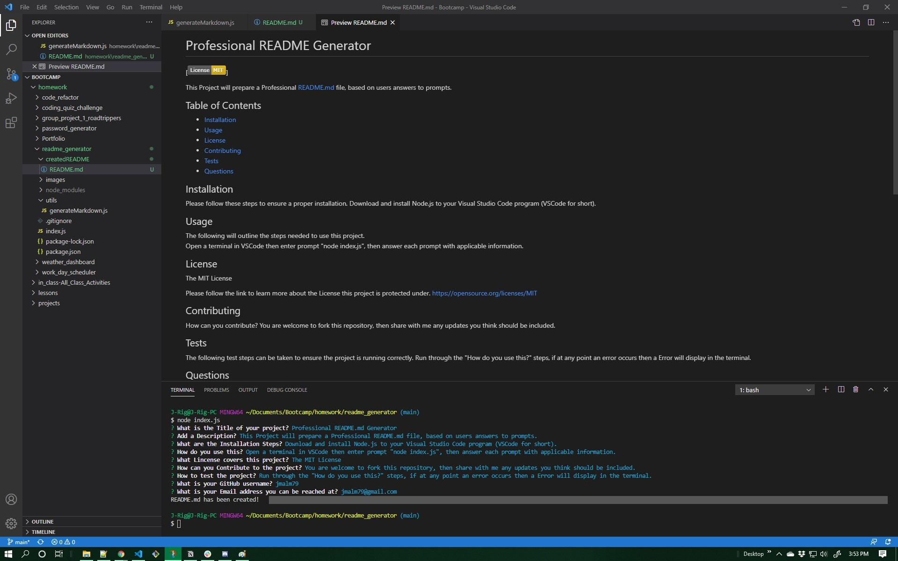

# Professional README Generator

  []

  This Project will prepare a Professional README.md file, based on users answers to prompts.

  ## Table of Contents
  * [Installation](#Installation)
  * [Usage](#Usage)
  * [License](#License)
  * [Contributing](#Contributing)
  * [Tests](#Tests)
  * [Questions](#Questions)

## Installation

Please follow these steps to ensure a proper installation. 
Download and install Node.js to your Visual Studio Code program (VSCode for short).

## Usage

The following will outline the steps needed to use this project.  
Open a terminal in VSCode then enter prompt "node index.js", then answer each prompt with applicable information.

## License
The MIT License

Please follow the link to learn more about the License this project is protected under. 
[https://opensource.org/licenses/MIT](https://opensource.org/licenses/MIT)

## Contributing

How can you contribute? 
You are welcome to fork this repository, then share with me any updates you think should be included. 

## Tests

The following test steps can be taken to ensure the project is running correctly. 
Run through the "How do you use this?" steps, if at any point an error occurs then a Error will display in the terminal.

## Questions

Please contact me with any questions about this project. 

My GitHub URL is [https://github.com/jmalm79](https://github.com/jmalm79)

Email: jmalm79@gmail.com

